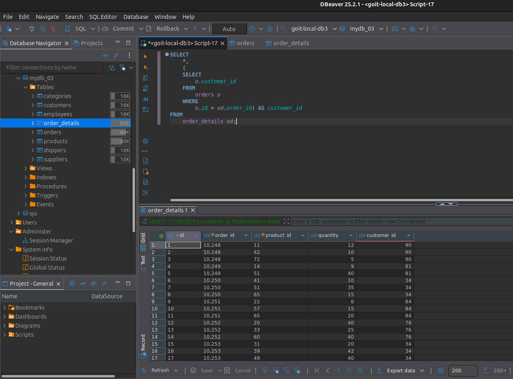
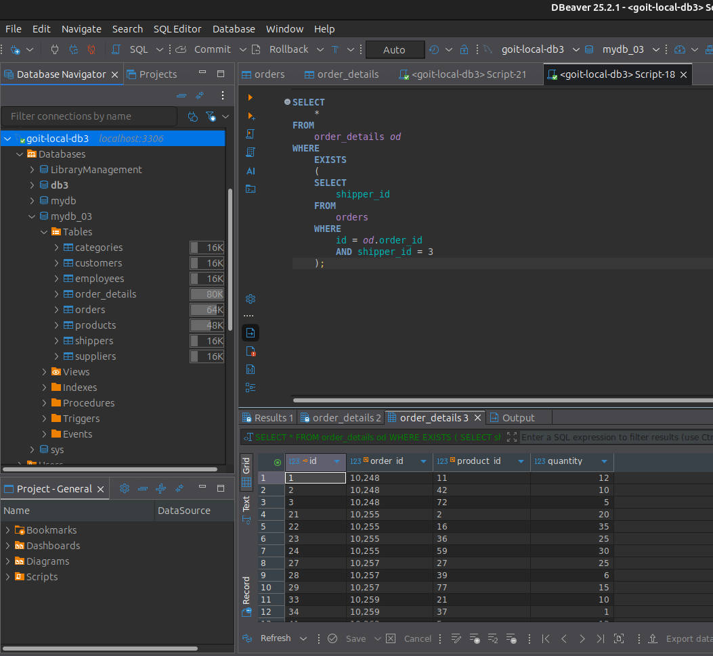
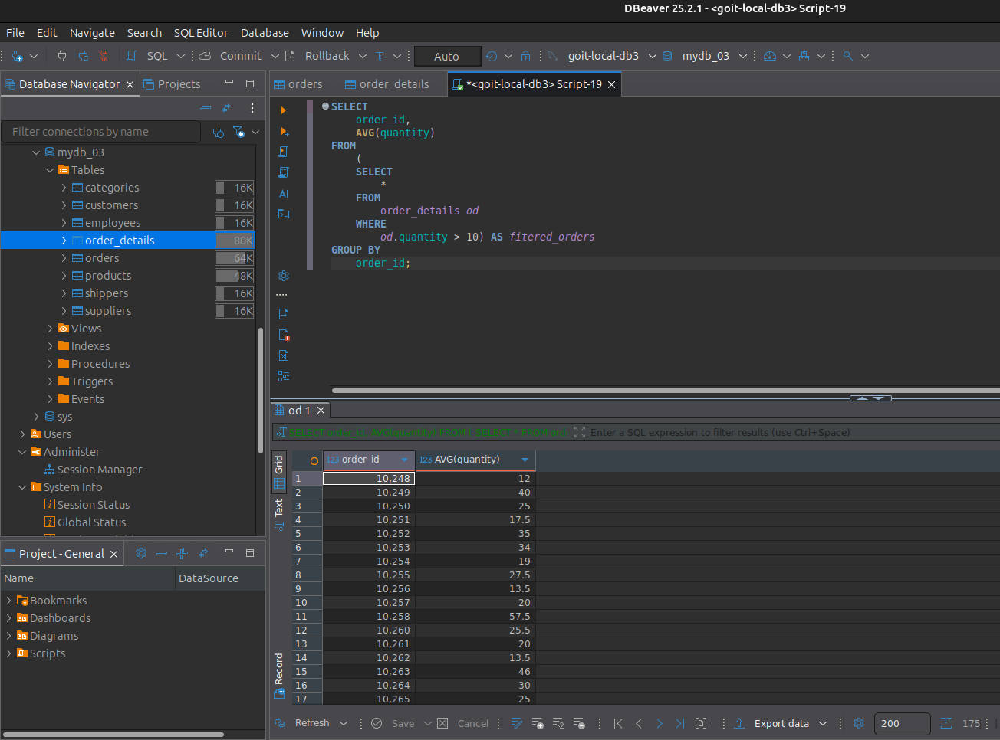
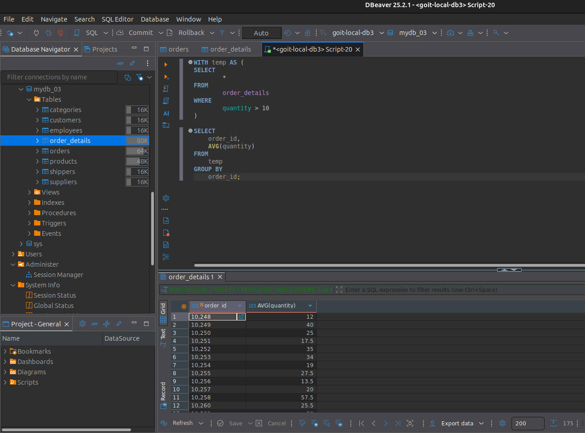
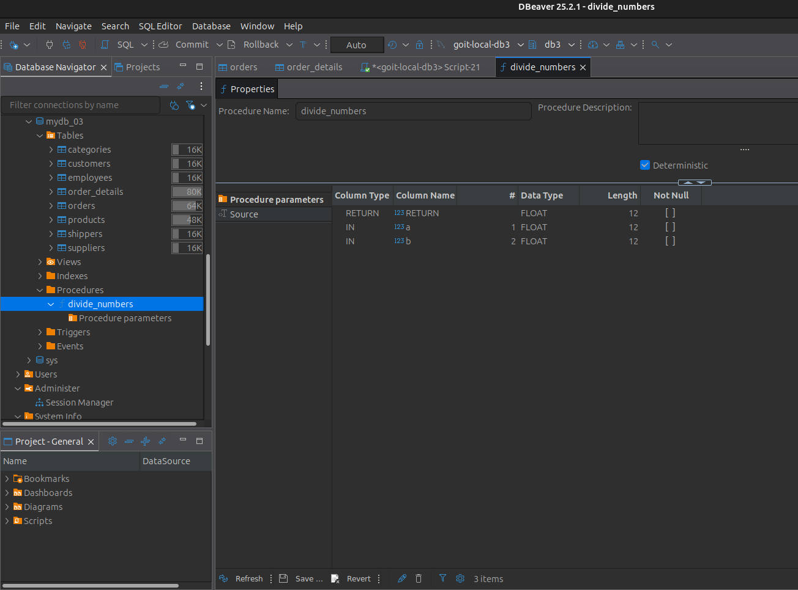
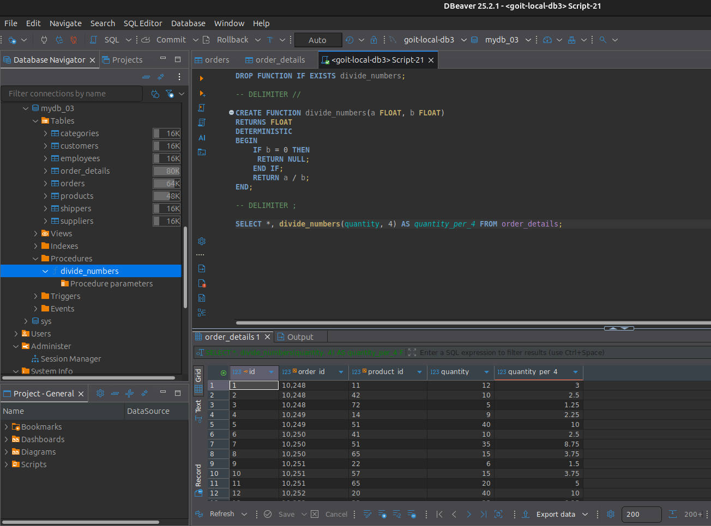

# GoIT RDB Homework 05

## 📋 Overview

This project is part of the GoIT Relational Database course, focusing on MySQL database.

## 🎯 Objectives

-   Master advanced **SQL** subquery techniques in different clauses (**`SELECT`**, **`WHERE`**, **`FROM`**)
-   Practice working with **Common Table Expressions (CTEs)** using the **`WITH`** clause
-   Learn to create and use **user-defined functions** in **MySQL**
-   Work with **MySQL** version compatibility considerations for advanced features

## 🚀 Quick Start with Docker

For detailed setup instructions, including Docker container configuration, database creation, and data import procedures, please refer to the [MySQL Setup Guide](https://github.com/antmuraha/goit-rdb-hw-03/blob/main/mysql-setup.md).

## Tasks

1. Write an **SQL** query that displays the **`order_details`** table along with the **`customer_id`** field from the **`orders`** table for each corresponding record in the **`order_details`** table.

This should be done using a subquery in the **`SELECT`** statement.

```sql
SELECT
	*,
	(
	SELECT
		o.customer_id
	FROM
		orders o
	WHERE
		o.id = od.order_id) AS customer_id
FROM
	order_details od;
```

**Result:**


2. Write an **SQL** query that displays the **`order_details`** table. Filter the results so that the corresponding record from the **`orders`** table meets the condition **`shipper_id = 3`**.

This should be done using a subquery in the **`WHERE`** clause.

```sql
SELECT
	*
FROM
	order_details od
WHERE
	(
	SELECT
		o.shipper_id
	FROM
		orders o
	WHERE
		o.id = od.order_id) = 3;
```

**Result:**


3. Write an **SQL** query with a subquery in the **`FROM`** clause that selects rows from the **`order_details`** table where **`quantity > 10`**. For the resulting data, calculate the average value of the **`quantity`** field — grouping should be done by **`order_id`**.

```sql
SELECT
	order_id,
	AVG(quantity)
FROM
	(
	SELECT
		*
	FROM
		order_details od
	WHERE
		od.quantity > 10) AS fitered_orders
GROUP BY
	order_id;
```

**Result:**


4. Solve task 3 using the **`WITH`** clause to create a temporary table named **`temp`**. If your version of **MySQL** is earlier than 8.0, write the query using an approach similar to the one shown in the course notes.

```sql
WITH temp AS (
SELECT
		*
FROM
		order_details
WHERE
		quantity > 10
)

SELECT
	order_id,
	AVG(quantity)
FROM
	temp
GROUP BY
	order_id;
```

**Result:**


5. Create a function with two parameters that divides the first parameter by the second. Both parameters and the return value should be of type **`FLOAT`**.

Use the **`DROP FUNCTION IF EXISTS`** statement. Apply the function to the **`quantity`** attribute from the **`order_details`** table. The second parameter can be any number of your choice.

```sql
DROP FUNCTION IF EXISTS divide_numbers;

-- DELIMITER //

CREATE FUNCTION divide_numbers(a FLOAT, b FLOAT)
RETURNS FLOAT
DETERMINISTIC
BEGIN
	IF b = 0 THEN
	 RETURN NULL;
	END IF;
	RETURN a / b;
END;

-- DELIMITER ;

SELECT *, divide_numbers(quantity, 4) AS quantity_per_4 FROM order_details;
```

**Result:**



## 🤝 Contributing

This is a homework project for the GoIT course. If you're also a student working on similar exercises, feel free to use this as a reference, but make sure to understand the concepts and implement your own solution.

## 📄 License

This project is created for educational purposes as part of the GoIT course curriculum.
